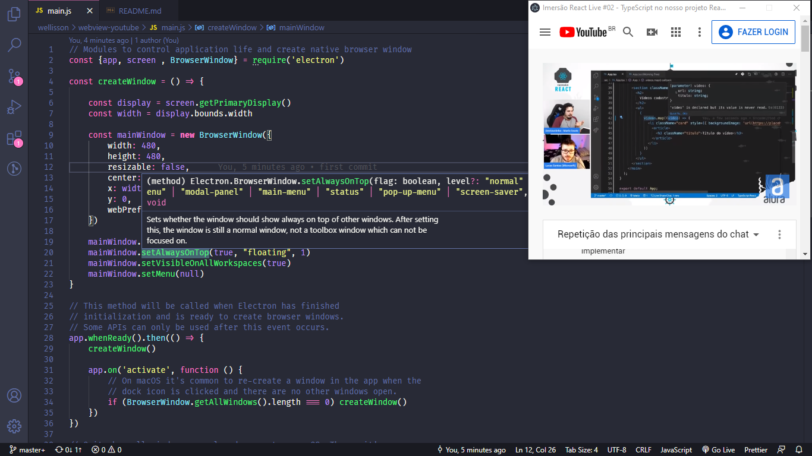

# webview-youtube 

Small app, to play youtube videos ▶️ , while coding 👨‍💻, drink coffee ☕ and studying 📚👨‍



## To Use

```bash
# Clone this repository
$ git clone https://github.com/wribeiiro/webview-youtube
# Go into the repository
cd webview-youtube
# Install dependencies
npm install
# Run the app
npm start
```